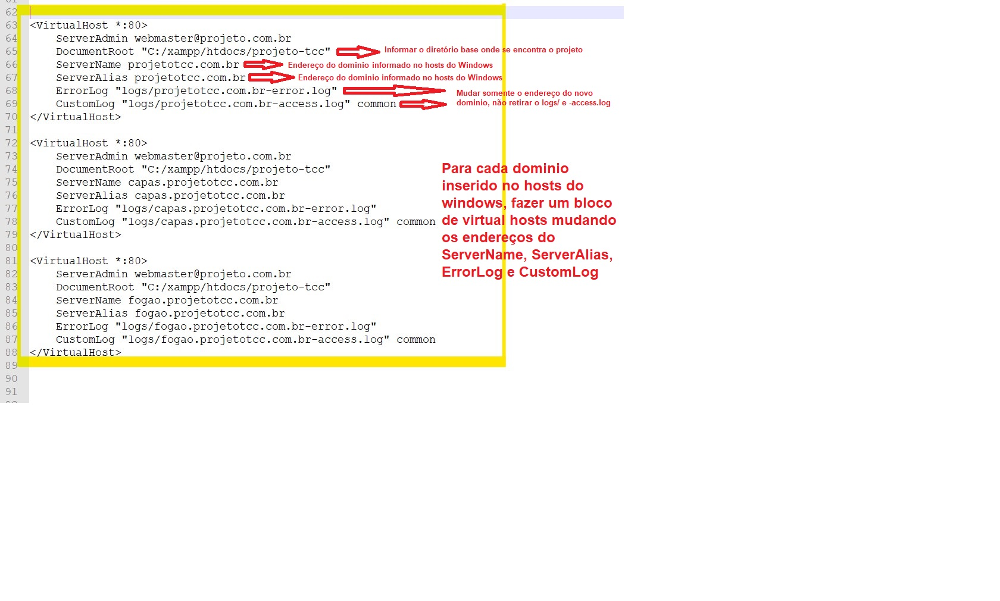

# Projeto TCC e-commerce

## Passos

* Baixar o xampp
* Baixar o composer
* Fazer o clone do projeto na pasta htdocs do xampp, geralmente em fica em C:/xampp/htdocs.
* Ir na pasta do projeto pelo CMD (prompt de comando), Exemplo: cd C:\xampp\htdocs\PastaDoProjeto e rodar o comando abaixo:
```sh
composer install
```
* Ao concluir fazer configurações no arquivo de host do windows, pois para simular o mais proximo possivel de uma arquitetura real de multitenancy, criaremos virtual hosts com subdominios.
* Abrir o arquivo de host do windows que geralmente fica em C:\Windows\System32\drivers\etc arquivo chamado host.
  * Incluir as linhas no final do arquivo dos possiveis subdominos a usar no projeto, conforme exemplo abaixo:
  <p><p>
 
* Pode observar que nesse caso teremos 3 endereços a usar, projetotcc.com.br, capas.projetotcc.com.br e fogao.projetotcc.com.br, pode ser incluso quantos endereços quiser para se usar.
* Proximo passo é abrir o arquivo httpd.vhosts.conf que se encontra em C:\xampp\apache\conf\extra
* No final do arquivo, voce criara um novo bloco como na imagem a baixo, um para cada endereço criado no hosts do windows: 
 <p></p>
 
 

  

.
.
.
.
.
.
