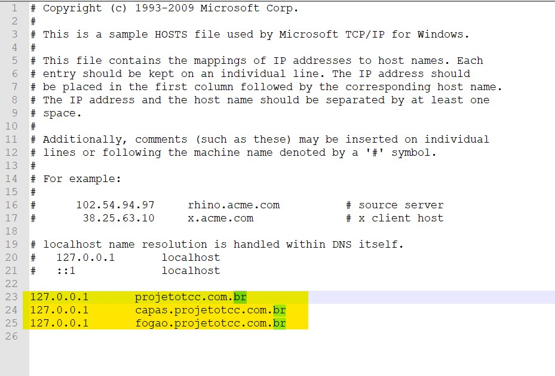
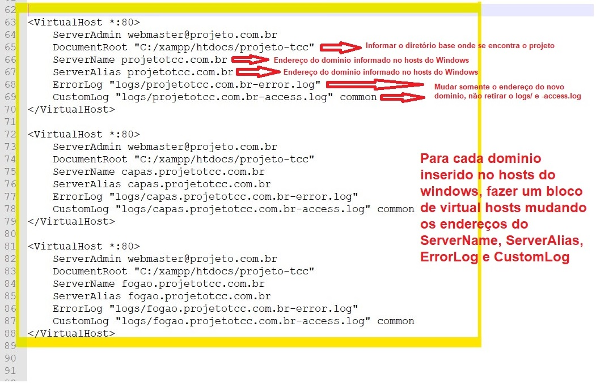

# Projeto TCC e-commerce

## Passos

* Baixar o xampp
* Baixar o composer
* Fazer o clone do projeto na pasta htdocs do xampp, geralmente em fica em C:/xampp/htdocs.
* Ir na pasta do projeto pelo CMD (prompt de comando), Exemplo: cd C:\xampp\htdocs\PastaDoProjeto e rodar o comando abaixo:
```sh
composer install
```
* Ao concluir fazer configurações no arquivo de host do windows, pois para simular o mais proximo possivel de uma arquitetura real de multitenancy, criaremos virtual hosts com subdominios.
* Abrir o arquivo de host do windows que geralmente fica em C:\Windows\System32\drivers\etc arquivo chamado host.
  * Incluir as linhas no final do arquivo dos possiveis subdominos a usar no projeto, conforme exemplo abaixo:
  <p><p>
 
 
* Pode observar que nesse caso teremos 3 endereços a usar, projetotcc.com.br, capas.projetotcc.com.br e fogao.projetotcc.com.br, pode ser incluso quantos endereços quiser para se usar.
* Proximo passo é abrir o arquivo httpd.vhosts.conf que se encontra em C:\xampp\apache\conf\extra
* No final do arquivo, voce criara um novo bloco como na imagem a baixo, um para cada endereço criado no hosts do windows: 
 <p></p>
 
 
* Caso o Xampp estiver aberto, voce deve parar o servidor do Apache e MySQL e iniciar novamente.
 <p></p>
 
 
* Agora pode abrir o projeto como se fosse um link real, simulando um multitanancy. Nas imagens abaixo foi acessado os tres endereços, não reparem nos erros no print pois está em ambiente de teste.
 <p></p>
 
  
 
 <p></p>

* Abrir o PhpMyAdmin atraves do Xampp no botão "Admin" do MySQL para fazer a inclusão do banco de dados e tabelas.
 <p></p>
 
 
* Clicar no botão "SQL" conforme abaixo: 
<p></p>


* E então executar o script para criação do banco de dados que se encontra na raiz do projeto com nome de "Script ecommerce.sql"
 * Primeiro executar o seguinte comando.
 ```sh
create database if not exists ecommerce
default character set utf8
default collate utf8_general_ci;
 ```
 * Depois selecionar o banco de dados no lado esquerdo.
 
<p></p>


 * Clicar em SQL novamente e rodar o restante do script.

<p>A base está devidamente criada e pronta para desenvolvimento</p>
 

  

.
.
.
.
.
.
